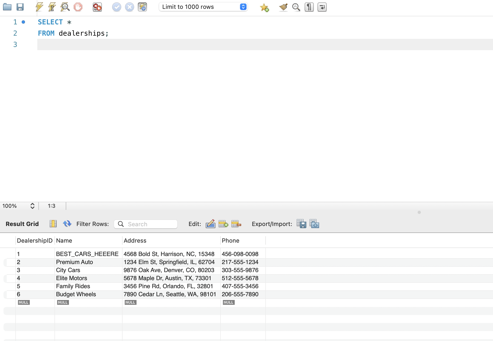
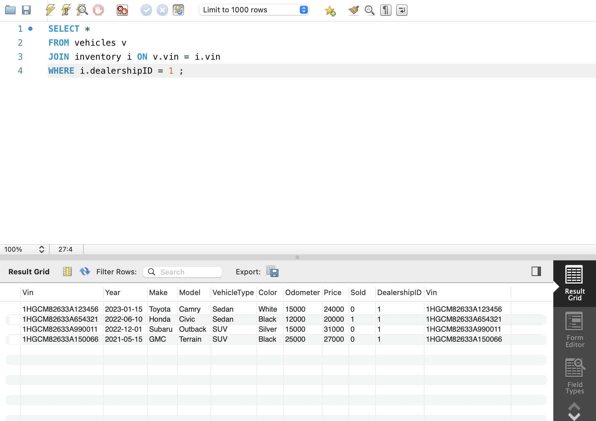
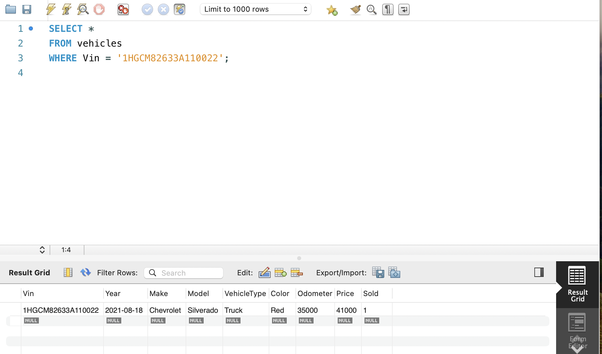
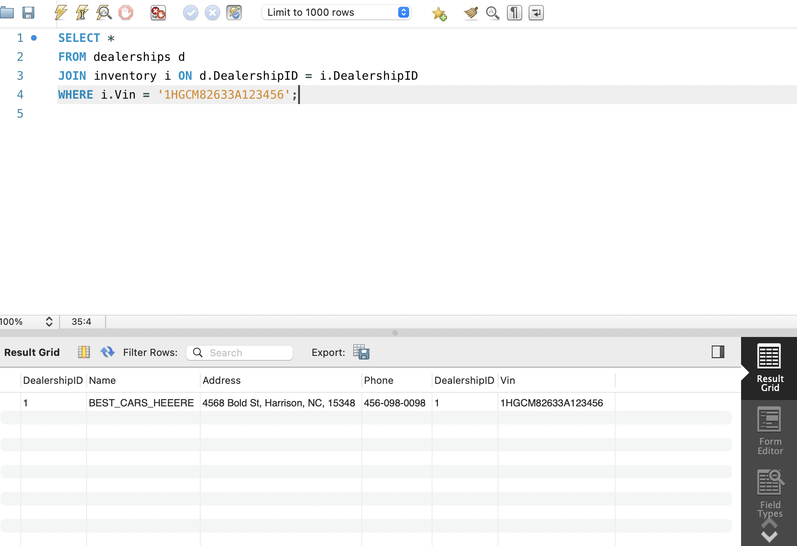
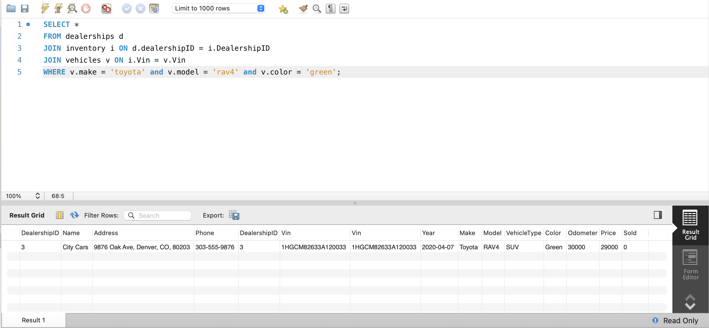
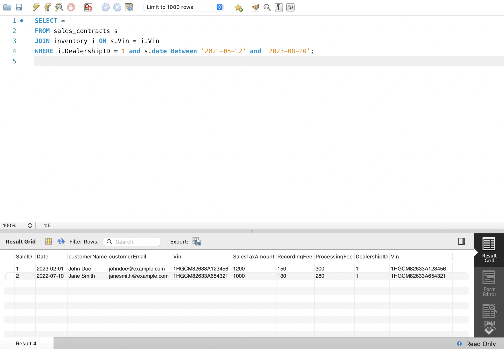

# Dealership Database Management

## Description of the Project

This MySQL project implements a dealership database management system that allows users to manage dealership inventory, track vehicle sales and leases, and query specific information about dealerships and vehicles. The database is designed to store and retrieve data efficiently, providing functionality for dealership operations such as vehicle inventory management and customer transaction tracking.

## User Stories

The following user stories guided the development of this application:

- **As a dealership manager**, I want to store and retrieve dealership information so that I can manage multiple locations effectively.
- **As a dealership manager**, I want to track the inventory of vehicles available at each dealership so that customers have accurate options.

## Setup

Instructions on how to set up and run the project using MySQL Server and MySQL Workbench

### Prerequisites

- IntelliJ IDEA: Ensure you have IntelliJ IDEA installed, which you can download from [here](https://www.jetbrains.com/idea/download/).
- Java SDK: Make sure Java SDK is installed and configured in IntelliJ.

### Setting Up the Database

1. Download or clone the project files.

2. Open MySQL Workbench and connect to your MySQL server.

3. Open the SQL script provided in the project folder.

4. Run the script to create the database, tables, and sample data.

### Once the database is set up, you can run queries using MySQL Workbench or a command-line interface:

Use USE car_dealership; to select the database.

Run specific queries to interact with the database, such as retrieving inventory or tracking sales.

## Technologies Used

- MySQL: Used for database management.
- MySQL Workbench: Used as the primary tool for creating and querying the database.
- VS Code: README creation. 

## Demo
### Question 1 
Get all dealerships

### Question 2  
Find all vehicles for a specific dealership

### Question 3 
Find a car by VIN

### Question 4  
Find the dealership where a certain car is located, by VIN

### Question 5 
 Find all dealerships that have a certain car type (Green Toyota RAV4)

### Question 6 
Get all sales information for a specific dealer for a specific date range

## Future Work

- Web Interface: Develop a web-based application for easier interaction with the database.

## Thanks

- Thank you to Raymond and for continuous support and guidance.